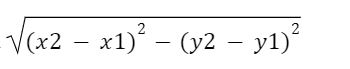

# DISTANCE-BETWEEN-TWO-POINTS

## AIM:
To write a python program to find the distance two 2 points
## ALGORITHM:
### Step 1:
import math 
### Step 2:
Initialise the two values 
### Step 3: 
Substitute the values in distance  formula 
### Step 4:
Print the values using format to display the values with two points
### Step 5: 
End the program
### PROGRAM:
  ``````
  #Program to find the distance between two points.
#Developed by: Dhivya Dharshini B
#RegisterNumber: 23008727
import math
x1=4
y1=2
x2=10
y2=6
distance =math.sqrt((x2-x1)**2+(y2-y1)**2)
print("{:.2f}".format(distance))
``````
### OUTPUT:

### RESULT:
Thus the distance between two points are executed sucessfully
